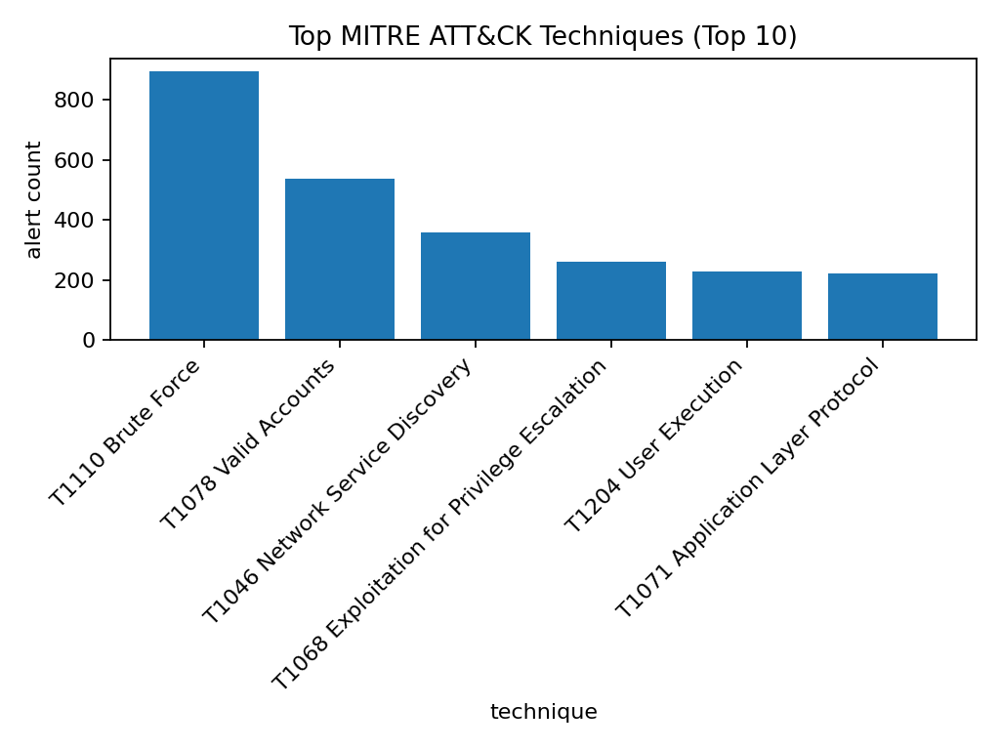

# Explainable SOC Alert Prioritization System

## Overview
Security Operations Centers (SOCs) receive thousands of alerts daily, many of which are false positives.  
This project simulates a **real SOC alert triage pipeline** that:

- Generates realistic security alerts
- Engineers SOC-relevant features
- Assigns **risk scores** using explainable rule-based logic
- Produces **human-readable explanations** for each alert
- Visualizes alert risk distribution and contributing factors


The goal is to demonstrate **SOC analyst decision-making**, not just model accuracy.

---

## Key Features
- Synthetic SOC alert generation (failed logins, scans, malware, etc.)
- Feature engineering aligned with SOC workflows
- Rule-based risk scoring (transparent & auditable)
- Explainable alert prioritization (why an alert is risky)
- Analyst-friendly CSV, JSON, and visual outputs
- End-to-end pipeline runnable with a single command
- MITRE ATT&CK tactic/technique mapping for alert taxonomy

---

## Project Structure
soc-alert-prioritizer/
<br>├─ src/
<br>│ ├─ data_gen/ # Synthetic SOC alert generation
<br>│ ├─ features/ # Feature engineering
<br>│ ├─ scoring/ # Rule-based risk scoring
<br>│ ├─ explain/ # Explainability logic
<br>│ ├─ evaluation/ # Metrics & visualizations
<br>│ └─ main.py # Pipeline entry point
<br>├─ data/ # Generated data (ignored in Git)
<br>├─ reports/
<br>│ ├─ figures/ # PNG visualizations
<br>│ └─ sample_outputs/ # Recruiter-friendly samples
<br>├─ requirements.txt
<br>└─ README.md


---

## How the Pipeline Works
1. **Generate Alerts**  
   Synthetic alerts simulating real SOC telemetry are created.

2. **Build Features**  
   SOC-relevant signals such as:
   - Failed login bursts
   - Unusual login hours
   - High-risk ports
   - Repeated attacker behavior

3. **Risk Scoring**  
   Alerts are scored using weighted rule-based logic.

4. **Explainability**  
   Each alert includes the **top contributing reasons** behind its risk score.

5. **Visualization**  
   Charts summarize alert risk distribution and dominant risk factors.

---

## How to Run

### 1. Install dependencies
```bash
pip install -r requirements.txt

```

### 2. Run the full pipeline
```bash
python -m src.main

```

## Example Output
### SampleJSON (Explainable Alert)

{
  "alert_id": 1842,
  "risk_score": 0.83,
  "risk_level": "HIGH",
  "explanations": [
    "Repeated failed logins from the same source IP",
    "Activity during unusual hours",
    "High-risk port targeted"
  ]
}
## ATT&CK Techniques in High-Risk Alerts

Below is a visualization of the most common MITRE ATT&CK techniques among high risk alerts:



### Generated Artifacts
- reports/sample_outputs/scored_alerts_sample.csv
- reports/sample_outputs/scored_alerts_sample.json
- reports/figures/score_distribution.png
- reports/figures/top_reasons.png
- reports/figures/high_risk_alert_examples.png

## Why This Matters for SOC Roles
- Mirrors real SOC alert triage
- Emphasizes interpretability, not black-box models
- Demonstrates security + analytical thinking
- Easy to extend with threat intelligence or ATT&CK mapping

## Planned Enhancements
- SIEM-style export (Splunk/Elastic-ready JSON)
- Alert suppression / false-positive reduction rules
- Analyst investigation queue (ranked worklist + SLA)
- ML-assisted scoring